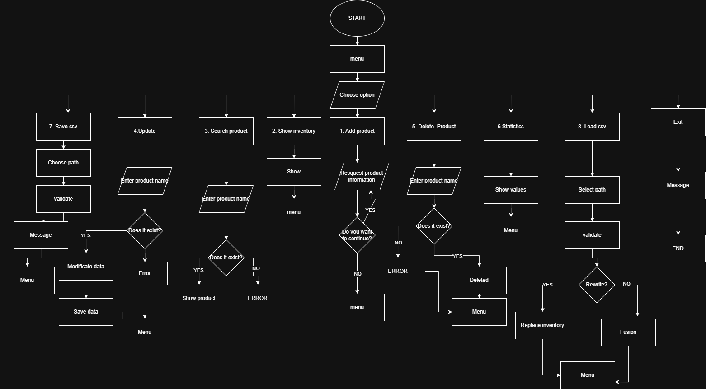

# Inventory Management System

## Description
This is an inventory management system developed in Python. It allows users to add, search, update, and delete products. The system also provides basic statistics, saves and loads data in csv.

## How it works
The program runs in a menu-based interface in the console.
Users can select different options:
- Add a new product (name, price, quantity)
- Show all products in the inventory
- Search for a product by name
- Update product information
- Delete a product
- View statistics such as total value, total units, etc.
- Save inventory to a csv
- Load inventory from a csv.
- Exit of program.
  
The data is stored in a list of dictionaries during execution.

## Results
The system helps manage products easily from the console. It shows clear messages for each action and handles errors like empty inventory or invalid data.Users can also save and load their inventory using CSV files for persistence.

Autor: Ricardo Llanos
